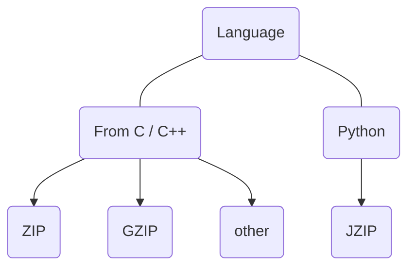

# Jzip

Jzip stands fo Json zip

Developed using Python, but with full functionality.

## 📖 Table of Contents

* [Target](#-target)
* [Inspection record](#-inspection-record)

## 🎯 Target

This is a diagram of the project.

## 📜 Inspection record

Compress the enwik8 file.

| Name | Compress (s) | Extract (s) | Size (MB) |
| ----------- | ----------- | ----------- | ----------- |
| GZIP | ~3.5 - 4.0 | ~0.40 | 36.5 |
| ZIP | ~4.0 - 5.0 | ~0.50 | 36.5 |
| 7-Zip | ~25.0 - 40.0 | ~2.00 | 23.1 |
| XZ | ~30.0 - 50.0 | ~3.00 | ~20-25 |
| Jzip | 3.25 | 0.29 | 36.5 |
